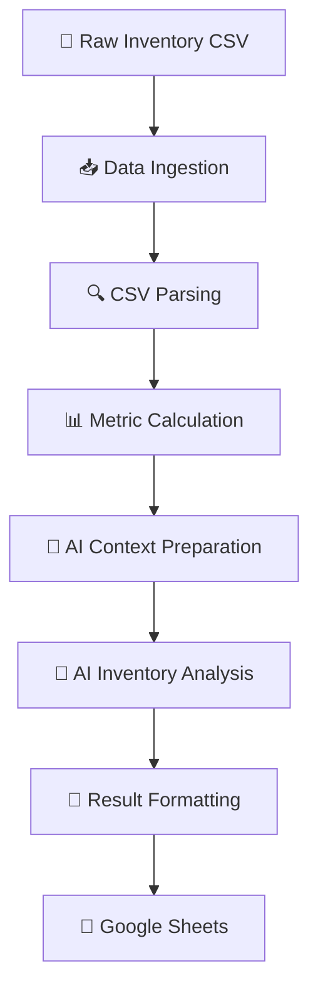
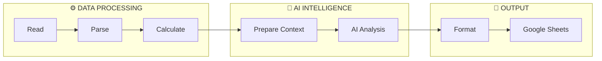

# 🤖 AI-Powered Inventory Analysis Pipeline

<p align="center">

**Transform raw inventory data into structured, AI-assisted operational insights.**

<br>

<code>INGEST → PARSE → COMPUTE → PREPARE → ANALYZE → FORMAT → STORE</code>

</p>

<p align="center">


</p>

---

## 🧭 Overview

**AI-Powered Inventory Analysis Pipeline** is a structured data-processing and AI-analysis workflow that transforms raw inventory records into **calculated metrics, AI-assisted insights, and structured spreadsheet output**.

The system is intentionally designed around a clear processing boundary:

```text
                    RAW INVENTORY DATA
                           │
                           ▼
                    ┌─────────────┐
                    │   INGEST    │
                    └──────┬──────┘
                           ▼
                    ┌─────────────┐
                    │    PARSE    │
                    └──────┬──────┘
                           ▼
                    ┌─────────────┐
                    │   COMPUTE   │
                    └──────┬──────┘
                           ▼
                    ┌─────────────┐
                    │   PREPARE   │
                    └──────┬──────┘
                           ▼
                    ┌─────────────┐
                    │   ANALYZE   │
                    │     AI      │
                    └──────┬──────┘
                           ▼
                    ┌─────────────┐
                    │   FORMAT    │
                    └──────┬──────┘
                           ▼
                    ┌─────────────┐
                    │    STORE    │
                    └─────────────┘
```

> **Core principle:** deterministic processing handles data transformation and metric computation, while AI is used for interpretation of the prepared context.

---

# 🎯 Problem

Raw inventory data contains operational information, but the raw records themselves do not immediately provide a useful analytical view.

A typical inventory review may require:

* Reading and structuring inventory records
* Calculating relevant values
* Preparing the information for analysis
* Identifying meaningful inventory conditions
* Interpreting the processed information
* Recording the resulting analysis for review

This project creates a **repeatable pipeline** that connects these stages into one controlled workflow.

### From data → intelligence

```text
┌─────────────────────┐
│  Raw Inventory CSV  │
└──────────┬──────────┘
           │
           ▼
┌─────────────────────┐
│ Structured Records  │
└──────────┬──────────┘
           │
           ▼
┌─────────────────────┐
│ Calculated Metrics  │
└──────────┬──────────┘
           │
           ▼
┌─────────────────────┐
│   AI-Ready Context  │
└──────────┬──────────┘
           │
           ▼
┌─────────────────────┐
│  AI-Generated       │
│     Insights        │
└──────────┬──────────┘
           │
           ▼
┌─────────────────────┐
│ Structured Results  │
└──────────┬──────────┘
           │
           ▼
┌─────────────────────┐
│   Google Sheets     │
└─────────────────────┘
```

---

# 🧠 Architecture

The architecture separates **data engineering responsibilities** from **AI reasoning**.


### Architecture at a glance

| Layer                      | Responsibility                               |
| :------------------------- | :------------------------------------------- |
| 📥 **Ingestion**           | Reads the inventory source                   |
| 🔍 **Parsing**             | Converts CSV content into structured records |
| 📊 **Computation**         | Calculates required inventory metrics        |
| 🧠 **Context Preparation** | Creates AI-ready analytical context          |
| 🤖 **AI Analysis**         | Interprets the prepared information          |
| 🧾 **Formatting**          | Produces a consistent result structure       |
| 📑 **Output**              | Stores the final analysis in Google Sheets   |

---

# 🔥 Core Design Principle

## Deterministic Data + AI Interpretation

The project does **not** treat AI as a replacement for the complete data-processing pipeline.

Instead:

```text
                  INVENTORY ANALYSIS
                         │
          ┌──────────────┴──────────────┐
          │                             │
          ▼                             ▼
   DATA PROCESSING                 AI ANALYSIS
          │                             │
   Read → Parse →                 Interpret
   Calculate                     Prepared Context
          │                             │
          └──────────────┬──────────────┘
                         ▼
                   STRUCTURED
                      OUTPUT
                         │
                         ▼
                  GOOGLE SHEETS
```

### Why this matters

| Design Decision             | Benefit                 |
| :-------------------------- | :---------------------- |
| Deterministic calculations  | Reproducible results    |
| Structured AI context       | More focused AI input   |
| Separated processing stages | Easier maintenance      |
| Dedicated formatting stage  | Predictable output      |
| Modular architecture        | Easier future extension |

---

# ⚙️ Workflow

<details>
<summary><strong>01 · Inventory Ingestion</strong></summary>

<br>

The workflow begins with an inventory CSV file.

The source file establishes the input boundary for the processing pipeline.

```text
Inventory CSV
     ↓
Read Inventory
```

</details>

<details>
<summary><strong>02 · Inventory Parsing</strong></summary>

<br>

The CSV contents are converted into structured inventory records.

```text
CSV Contents
     ↓
Parsed Inventory Records
```

This separates raw file representation from processable inventory information.

</details>

<details>
<summary><strong>03 · Metric Calculation</strong></summary>

<br>

The structured inventory records are processed to calculate the metrics required for analysis.

```text
Parsed Inventory
     ↓
Metric Calculation
     ↓
Calculated Inventory Context
```

This is a deterministic processing stage.

</details>

<details>
<summary><strong>04 · AI Context Preparation</strong></summary>

<br>

The processed records and calculated metrics are transformed into an analysis-ready representation.

```text
Inventory Records
       +
Calculated Metrics
       ↓
AI Analysis Context
```

This stage forms the boundary between data processing and AI analysis.

</details>

<details>
<summary><strong>05 · AI Inventory Analysis</strong></summary>

<br>

The prepared context is supplied to an AI model for interpretation.

```text
Prepared Inventory Context
            ↓
       AI Analysis
            ↓
     Analytical Result
```

The AI layer focuses on interpretation rather than raw data transformation.

</details>

<details>
<summary><strong>06 · Result Formatting</strong></summary>

<br>

The generated analysis is converted into a consistent output structure.

```text
AI Analysis
     ↓
Structured Result
```

</details>

<details>
<summary><strong>07 · Google Sheets Output</strong></summary>

<br>

The formatted result is written to Google Sheets.

```text
Formatted Analysis
        ↓
   Google Sheets
```

The spreadsheet acts as the persistent output layer.

</details>

---

# 🔄 End-to-End Pipeline



### One-line representation

<p align="center">

**📄 Ingest → 🔍 Parse → 📊 Compute → 🧠 Prepare → 🤖 Analyze → 🧾 Format → 📑 Store**

</p>

---

# ✨ Key Capabilities

| Capability                  | Description                                         |
| :-------------------------- | :-------------------------------------------------- |
| 📄 **CSV Ingestion**        | Accepts inventory data through CSV                  |
| 🔍 **Data Parsing**         | Converts source data into structured records        |
| 📊 **Metric Calculation**   | Performs explicit inventory calculations            |
| 🧠 **Context Preparation**  | Creates structured AI-ready information             |
| 🤖 **AI Interpretation**    | Generates inventory-related analytical observations |
| 🧾 **Result Formatting**    | Normalizes generated analysis                       |
| 📑 **Google Sheets Output** | Persists the final analysis                         |
| 🧩 **Modular Workflow**     | Keeps processing responsibilities separated         |

---

# 📥 Input

The primary input is an **inventory CSV file**.

```text
┌─────────────────────┐
│   INVENTORY CSV     │
└──────────┬──────────┘
           ↓
      Parse Records
           ↓
    Calculate Metrics
```

The exact columns and metric definitions depend on the inventory dataset used by the implementation.

---

# 📤 Output

The final output is a formatted inventory analysis written to **Google Sheets**.

```text
Calculated Context
        ↓
AI Interpretation
        ↓
Formatted Analysis
        ↓
Google Sheets
```

This creates a persistent and human-readable representation of the generated analysis.

---

# 🧩 Technology Components

| Technology / Component | Role                                         |
| :--------------------- | :------------------------------------------- |
| 📄 **CSV**             | Inventory data source                        |
| 🤖 **AI Model**        | Interpretation of prepared inventory context |
| 📑 **Google Sheets**   | Final result storage                         |

> Only technologies that are actually part of the implementation should be added to this table.

---

# 🔐 Configuration & Security

External services used by the AI-analysis and Google Sheets stages require appropriate credentials and configuration.

### 🔒 Never commit secrets

```text
❌ API Keys
❌ Access Tokens
❌ Passwords
❌ Private Credentials
❌ Secret Configuration Values
```

Use environment variables or the credential-management mechanism supported by the execution environment.

---

# ▶️ Running the Pipeline

A typical execution requires:

* A valid inventory CSV
* Required AI service credentials
* Access to the target Google Sheets destination
* Project-specific configuration
* The configured workflow trigger

### Execution path

```text
CSV
 │
 ▼
Parse
 │
 ▼
Metrics
 │
 ▼
AI Context
 │
 ▼
AI Analysis
 │
 ▼
Format
 │
 ▼
Google Sheets
```

---

# 📁 Repository Structure

```text
project-root/
│
├── README.md
│
├── workflow/
│   └── inventory-analysis.json
│
├── data/
│   └── inventory.csv
│
└── screenshots/
    └── workflow.png
```

> The repository structure should always reflect the actual implementation.

---

# 📸 Workflow Preview

When a workflow screenshot is available, add it to:

```text
screenshots/workflow.png
```

Then reference it using:

```markdown

```

### Recommended screenshot

The screenshot should clearly show:

```text
Inventory Input
      ↓
Data Processing
      ↓
Metric Calculation
      ↓
AI Analysis
      ↓
Result Formatting
      ↓
Google Sheets
```

---

# 📊 Project Flow Summary



---

# 🏛️ Engineering Decisions

### 01 — Process before asking AI

Data that can be explicitly processed is handled before the AI stage.

### 02 — Give AI structured context

The AI receives relevant processed information rather than raw file formatting.

### 03 — Separate responsibilities

Each stage has a clearly defined responsibility.

### 04 — Normalize AI output

The generated response passes through a formatting stage before storage.

### 05 — Keep the architecture extensible

Individual stages can evolve independently without redesigning the entire pipeline.

---

# 📈 Engineering Value

This project demonstrates a practical approach to combining **structured data processing with AI-based reasoning**.

The important architectural distinction is:

```text
┌─────────────────────────────────┐
│       DETERMINISTIC LOGIC       │
│                                 │
│  Read → Parse → Calculate       │
│                                 │
│  Explicit • Reproducible        │
└───────────────┬─────────────────┘
                │
                ▼
┌─────────────────────────────────┐
│          AI REASONING           │
│                                 │
│  Prepared Context → Analysis    │
│                                 │
│  Interpret • Generate Insights  │
└───────────────┬─────────────────┘
                │
                ▼
┌─────────────────────────────────┐
│        STRUCTURED OUTPUT        │
│                                 │
│       Format → Store            │
└─────────────────────────────────┘
```

This creates clear boundaries between **data transformation, intelligence, and persistence**.

---

# ⚠️ Limitations

The current implementation focuses on the inventory-analysis workflow represented by this project.

The quality of the final analysis depends on:

* Input inventory data quality
* Inventory data structure
* Calculated metrics
* AI context supplied to the model
* Consistency of the generated AI response
* Availability and configuration of the output spreadsheet

> The workflow should **not** be interpreted as a real-time inventory synchronization system unless that functionality is explicitly implemented.

---

# 🔮 Future Improvements

The architecture provides several natural extension points.

<details>
<summary><strong>🌐 Broader Data Sources</strong></summary>

Support additional inventory sources beyond CSV files.

</details>

<details>
<summary><strong>📊 Historical Comparison</strong></summary>

Maintain previous analysis results and compare inventory conditions across multiple runs.

</details>

<details>
<summary><strong>🚨 Exception Detection</strong></summary>

Introduce explicit rules for identifying unusual or important inventory conditions before AI interpretation.

</details>

<details>
<summary><strong>🏢 Business-Specific Analysis</strong></summary>

Extend the metric and analysis layers with domain-specific inventory indicators.

</details>

<details>
<summary><strong>📑 Advanced Reporting</strong></summary>

Build a dedicated reporting interface on top of structured results.

</details>

<details>
<summary><strong>👤 Human Validation</strong></summary>

Introduce a review stage for validating AI-generated observations before operational use.

</details>

> These are potential extensions and are **not part of the current implementation**.

---

# 🧪 Example Execution

```text
01  Inventory CSV Provided
          │
          ▼
02  Inventory Records Read
          │
          ▼
03  CSV Contents Parsed
          │
          ▼
04  Relevant Metrics Calculated
          │
          ▼
05  AI Context Prepared
          │
          ▼
06  AI Analyzes Inventory Context
          │
          ▼
07  Analysis Formatted
          │
          ▼
08  Result Written to Google Sheets
```

---

# 📌 Current Project Status

| Area                  | Status |
| :-------------------- | :----: |
| Inventory CSV Input   |    ✅   |
| Inventory Parsing     |    ✅   |
| Metric Processing     |    ✅   |
| AI-Assisted Analysis  |    ✅   |
| Result Formatting     |    ✅   |
| Google Sheets Output  |    ✅   |
| Historical Comparison |   🔮   |
| Exception Detection   |   🔮   |
| Advanced Reporting    |   🔮   |

---

# 🗺️ Project Architecture at a Glance

```text
                         ┌──────────────────┐
                         │ INVENTORY CSV    │
                         └────────┬─────────┘
                                  │
                                  ▼
                         ┌──────────────────┐
                         │    INGEST        │
                         └────────┬─────────┘
                                  │
                                  ▼
                         ┌──────────────────┐
                         │     PARSE        │
                         └────────┬─────────┘
                                  │
                                  ▼
                         ┌──────────────────┐
                         │    COMPUTE       │
                         └────────┬─────────┘
                                  │
                                  ▼
                         ┌──────────────────┐
                         │    PREPARE       │
                         └────────┬─────────┘
                                  │
                                  ▼
                         ┌──────────────────┐
                         │   AI ANALYSIS    │
                         └────────┬─────────┘
                                  │
                                  ▼
                         ┌──────────────────┐
                         │     FORMAT       │
                         └────────┬─────────┘
                                  │
                                  ▼
                         ┌──────────────────┐
                         │ GOOGLE SHEETS    │
                         └──────────────────┘
```

---

# 👤 Author

<p align="center">

### **Sai Kiran**

**AI • Data Processing • Intelligent Automation**

</p>

---

<p align="center">

**Built around a simple principle:**

### `Process the data. Prepare the context. Let AI interpret. Store the result.`

</p>

<p align="center">

⭐ If you find this project useful, consider giving the repository a star.

</p>
